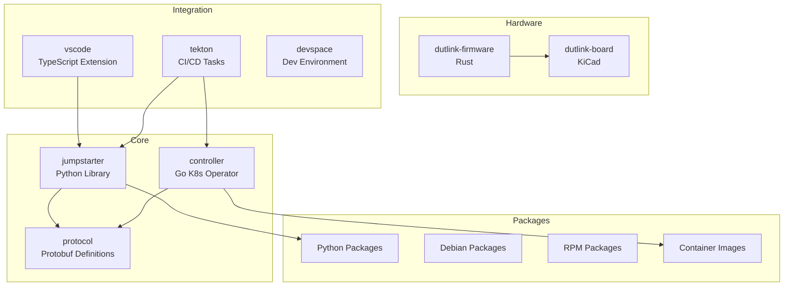

# Copilot Instructions for Jumpstarter Monorepo

## Overview

This document provides instructions for ongoing development in the Jumpstarter monorepo. The initial migration and integration has been completed, and this serves as a guide for continued development and maintenance.

## Migration Status: ✅ COMPLETED

The monorepo migration has been successfully completed. All 13 original repositories have been consolidated into `jumpstarter-mono` with working build systems, CI/CD pipelines, and unified development workflows.

## Development Guidelines

- Use mermaid for diagrams (e.g. in docs/architecture/index.md)
- Keep every change compatible with existing jumpstarter components (controller, router, exporter, client,...)
- When adding features, the default behaviour should be the same as in the upstream jumpstarter
- Documentation will be published on readthedocs.io and also with GitHub Pages
- Documentation shall also be rendered as PDF and ePUB, e.g. with pandoc

## Current Monorepo Structure ✅

The target structure has been successfully implemented:

```
jumpstarter-mono/                # ✅ IMPLEMENTED
├── README.md
├── LICENSE
├── .gitignore
├── Makefile                     # ✅ Root build orchestration
├── pyproject.toml               # ✅ Python workspace configuration (UV)
├── .github/                     # ✅ CI/CD workflows
│   ├── workflows/               # ✅ Automated CI/CD with reusable workflows
│   └── containers/              # ✅ CI container images
├── docs/                        # ✅ MkDocs documentation
├── scripts/                     # ✅ Utility scripts
├── core/                        # ✅ Core Jumpstarter components
│   ├── jumpstarter/             # ✅ Main Python library
│   ├── controller/              # ✅ Kubernetes controller (Go)
│   └── protocol/                # ✅ Protocol definitions
├── hardware/                    # ✅ Hardware components
│   ├── dutlink-board/           # ✅ Hardware design files
│   └── dutlink-firmware/        # ✅ Rust firmware
├── packages/                    # ✅ Package management
│   ├── python/                  # ✅ Python packages
│   ├── debian/                  # ✅ Debian packages
│   ├── rpm/                     # ✅ RPM packages
│   ├── container/               # ✅ Container images
│   └── repository-tools/        # ✅ Package repository tools
├── integrations/                # ✅ CI/CD and tooling integrations
│   ├── tekton/                  # ✅ Tekton tasks
│   ├── vscode/                  # ✅ VS Code extension
│   └── devspace/                # ✅ Development environments
├── templates/                   # ✅ Templates and scaffolding
│   └── driver/                  # ✅ Driver template
├── testing/                     # ✅ Testing infrastructure
│   ├── e2e/                     # ✅ End-to-end tests
│   ├── integration/             # ✅ Integration tests
│   └── fixtures/                # ✅ Test fixtures
└── lab-config/                  # ✅ Lab configuration tools
```

## Implemented Features ✅

### Build System

- ✅ **UV Python Workspace**: Unified Python package management
- ✅ **Go Modules**: Proper Go workspace configuration
- ✅ **Multi-language Makefile**: Root build orchestration
- ✅ **Automated CI/CD**: GitHub Actions with reusable workflows
- ✅ **Container Images**: Pre-built CI containers for fast builds
- ✅ **Semantic Versioning**: Automated version bumping and tagging

### Development Workflow

- ✅ **Pre-commit Hooks**: Multi-language linting and formatting
- ✅ **Unified Testing**: Cross-component test orchestration
- ✅ **Documentation**: MkDocs setup with automated publishing
- ✅ **Release Automation**: Fully automated release pipeline

## Current Development Focus

### Remaining Tasks (See CHECKLIST.md for details)

#### Phase 5: Documentation and Cleanup

- [ ] Consolidate remaining documentation → `docs/`
- [ ] Update README files
- [ ] Create component API documentation
- [ ] Archive old repositories and update external references

#### Phase 6: Development Environment Setup

- [ ] Create devcontainer setup for development and testing
- [ ] Integrate k3d for local Kubernetes testing
- [ ] Validate local action workflows with `act`

#### Phase 7: Jumpstarter Server

- [ ] Create standalone `jumpstarter-server` component
- [ ] Implement controller and router without Kubernetes dependency
- [ ] Add simple docker-compose setup for development

### Build and Development Commands

```makefile
# Available build commands (run `make help` for full list)
make help       # Show all available commands
make build      # Build all components
make test       # Run all tests
make lint       # Run all linters
make clean      # Clean build artifacts

# Component-specific commands
make build-python build-go build-rust build-web
make test-python test-go test-rust test-e2e
make lint-python lint-go lint-rust

# Development workflow
make dev-setup  # Setup development environment
make docs       # Build documentation
```

## Architecture Overview

### Component Relationships



## Contributing Guidelines

### Code Style and Standards

- **Python**: Use `ruff` for linting and formatting
- **Go**: Use `gofmt` and `golangci-lint`
- **Rust**: Use `rustfmt` and `clippy`
- **TypeScript**: Use `eslint` and `prettier`

### Testing Requirements

- All new features must include appropriate tests
- Run `make test` before submitting PRs
- E2E tests should be added for integration features
- Use `act` to test GitHub Actions locally

### Documentation

- Update relevant documentation for new features
- Use mermaid diagrams for architecture documentation
- Keep examples up to date

## Technical Considerations

### Performance Optimizations

- ✅ Container-based CI for faster builds (~18 min vs ~53 min)
- ✅ Parallel job execution in GitHub Actions
- ✅ Aggressive caching of dependencies and build artifacts
- 🔄 ARM64 container builds temporarily disabled (see CHECKLIST.md)

### Development Experience

- ✅ Pre-commit hooks for immediate feedback
- ✅ Unified commands via root Makefile
- ✅ Consistent tooling across all languages
- 🔄 Devcontainer setup planned for Phase 6

## Quick Reference

### Useful Commands

```bash
# Check current implementation status
cat CHECKLIST.md

# Build everything
make build

# Run tests for changed components
make test

# Update documentation
make docs

# Clean up workflow runs
scripts/cleanup-runs.sh 5 -y

# Clean up orphaned releases
scripts/cleanup-orphaned-releases.sh
```

### Key Files to Check

- `CHECKLIST.md` - Current implementation status
- `Makefile` - Available build commands
- `.github/workflows/` - CI/CD configuration
- `pyproject.toml` - Python workspace setup

## Next Development Priorities

Refer to `CHECKLIST.md` for the current status and remaining tasks. The primary focus areas are:

1. **Documentation consolidation** (Phase 5)
2. **Devcontainer setup** (Phase 6)
3. **Jumpstarter server development** (Phase 7)

---

**Status**: ✅ Migration Complete | 🔄 Active Development | 📋 See CHECKLIST.md for details
