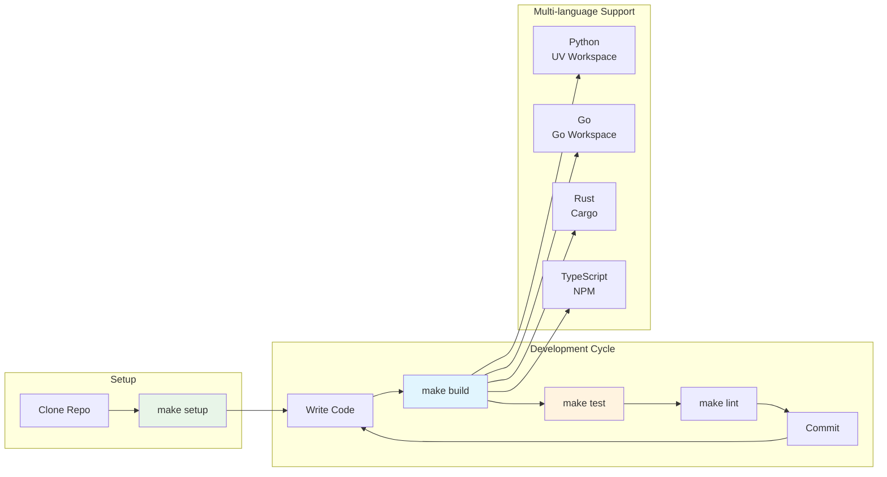
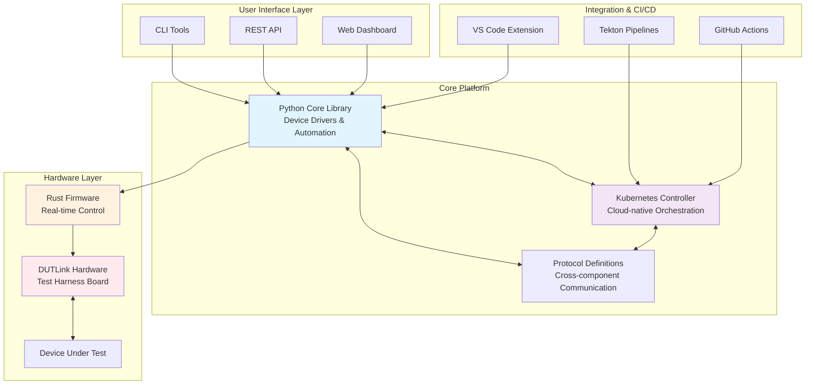

# Jumpstarter Monorepo

[](https://github.com/the78mole/jumpstarter-mono/actions/workflows/ci.yml)
[](https://opensource.org/licenses/Apache-2.0)

This is a monorepo containing all Jumpstarter components unified into a single, manageable repository. The goal is to simplify development, improve cross-component integration, and streamline the release process.

## 🚀 Quick Start

```bash
# Clone the repository
git clone https://github.com/the78mole/jumpstarter-mono.git
cd jumpstarter-mono

# Setup development environment
make setup

# Build all components
make build

# Run tests
make test
```

## 📁 Repository Structure

```
jumpstarter-mono/
├── core/                      # Core Jumpstarter components
│   ├── jumpstarter/           # Main Python library and CLI
│   ├── controller/            # Kubernetes controller (Go)
│   └── protocol/              # Protocol definitions
├── hardware/                  # Hardware-related components
│   ├── dutlink-board/         # Hardware design files
│   └── dutlink-firmware/      # Rust firmware
├── integrations/              # CI/CD and tooling integrations
│   ├── tekton/                # Tekton tasks and pipelines
│   ├── vscode/                # VS Code extension
│   └── devspace/              # Development environments
├── templates/                 # Templates and scaffolding
│   └── driver/                # Driver development template
├── testing/                   # Testing infrastructure
│   └── e2e/                   # End-to-end tests
└── lab-config/                # Lab configuration tools
```

## 🎯 Components

### Core Components

- **jumpstarter**: Main Python library providing the core Jumpstarter functionality, CLI tools, and device drivers
- **controller**: Kubernetes controller for managing Jumpstarter resources in cloud environments
- **protocol**: Shared protocol definitions and communication interfaces

### Hardware

- **dutlink-board**: Open hardware design files for the DUTLink test harness board
- **dutlink-firmware**: Rust firmware for the DUTLink board enabling hardware-in-the-loop testing

### Integrations

- **tekton**: CI/CD integration with Tekton pipelines for automated testing workflows
- **vscode**: Visual Studio Code extension for enhanced Jumpstarter development experience
- **devspace**: Development environment configurations and templates

### Templates

- **driver**: Template for creating new Jumpstarter device drivers

### Testing

- **e2e**: Comprehensive end-to-end test suite validating full system functionality

### Lab Configuration

- **lab-config**: Tools for configuring and managing hardware test labs

## 🛠️ Development

### Prerequisites

- Python 3.12+
- Go 1.22+
- Rust (latest stable)
- Node.js 18+
- UV (Python package manager)
- Make

### Development Workflow



### Available Commands

```bash
make help           # Show all available commands
make setup          # Setup development environment
make build          # Build all components
make test           # Run all tests
make lint           # Run all linters
make fmt            # Format all code
make clean          # Clean build artifacts
make docs           # Build documentation
```

### Language-specific Commands

```bash
# Python
make build-python   # Build Python components
make test-python    # Run Python tests
make lint-python    # Lint Python code

# Go
make build-go       # Build Go components
make test-go        # Run Go tests
make lint-go        # Lint Go code

# Rust
make build-rust     # Build Rust components
make test-rust      # Run Rust tests
make lint-rust      # Lint Rust code

# Web/TypeScript
make build-web      # Build web components
make lint-web       # Lint TypeScript code
```

## 📚 Documentation

Detailed documentation is available in the following documents:

- **[COPILOT_INSTRUCTIONS.md](COPILOT_INSTRUCTIONS.md)**: Comprehensive integration strategy and architecture
- **[IMPLEMENTATION_GUIDE.md](IMPLEMENTATION_GUIDE.md)**: Step-by-step implementation instructions
- **[docs/](docs/)**: User guides, API documentation, and tutorials

## 🚀 Installation

### From Source

```bash
# Install all Python components
pip install -e .

# Install Go components
cd core/controller && make install
```

### Packages

Pre-built packages will be available for:

- Python wheels (PyPI)
- Debian packages
- RPM packages
- Container images

## 🧪 Testing

The monorepo includes comprehensive testing at multiple levels:

- **Unit tests**: Individual component testing
- **Integration tests**: Cross-component testing
- **End-to-end tests**: Full system validation
- **Hardware-in-the-loop tests**: Real hardware testing

Run tests with:

```bash
make test           # All tests
make test-e2e       # End-to-end tests only
```

## 🏗️ Architecture

Jumpstarter provides a unified platform for hardware-in-the-loop testing with:



- **Python Core**: Main library with device drivers and automation tools
- **Kubernetes Integration**: Cloud-native deployment and resource management
- **Hardware Abstraction**: Support for various test hardware through drivers
- **CI/CD Integration**: Native support for popular CI/CD platforms
- **Multi-language Support**: Components in Python, Go, Rust, and TypeScript

## 🤝 Contributing

We welcome contributions! Please see our [contributing guidelines](docs/development/contributing.md) for details on:

- Code style and standards
- Testing requirements
- Pull request process
- Development workflow

## 📄 License

This project is licensed under the Apache License 2.0 - see the [LICENSE](LICENSE) file for details.

## 🔗 Links

- [Official Jumpstarter Website](https://jumpstarter.dev)
- [Documentation](https://jumpstarter.dev/docs)
- [Community Matrix](https://matrix.to/#/#jumpstarter:matrix.org)
- [Original Organization](https://github.com/jumpstarter-dev)

---

**Note**: This monorepo consolidates components from the [jumpstarter-dev](https://github.com/jumpstarter-dev) organization. Individual component repositories remain available for reference but active development will occur in this monorepo.
