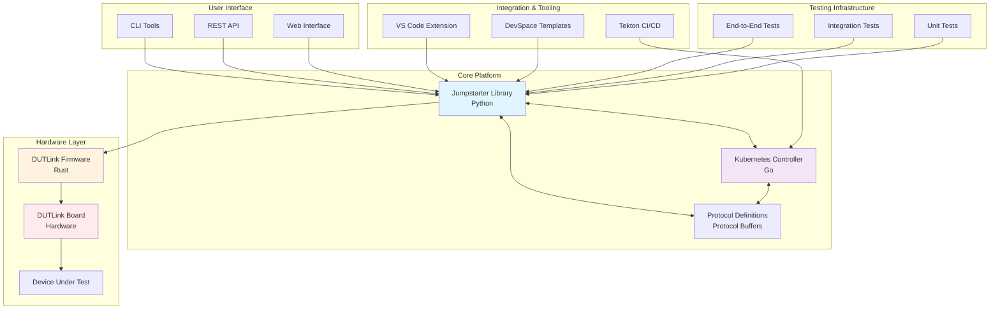
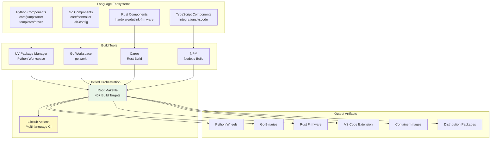
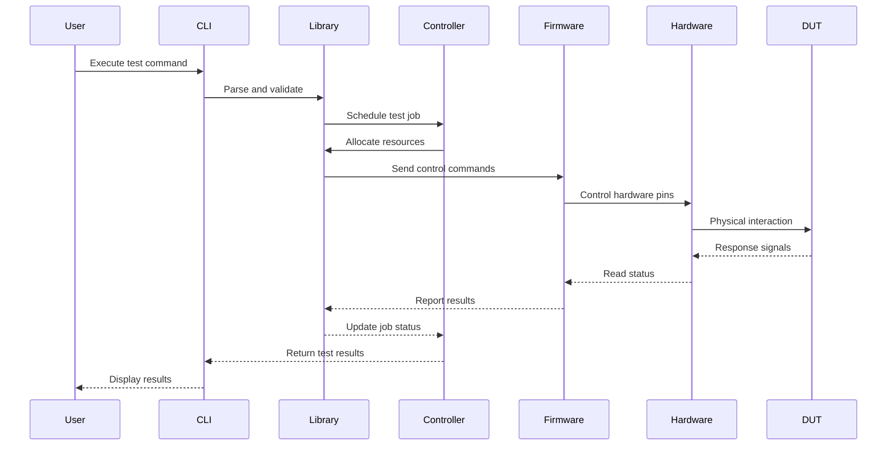
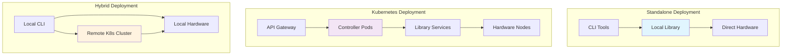
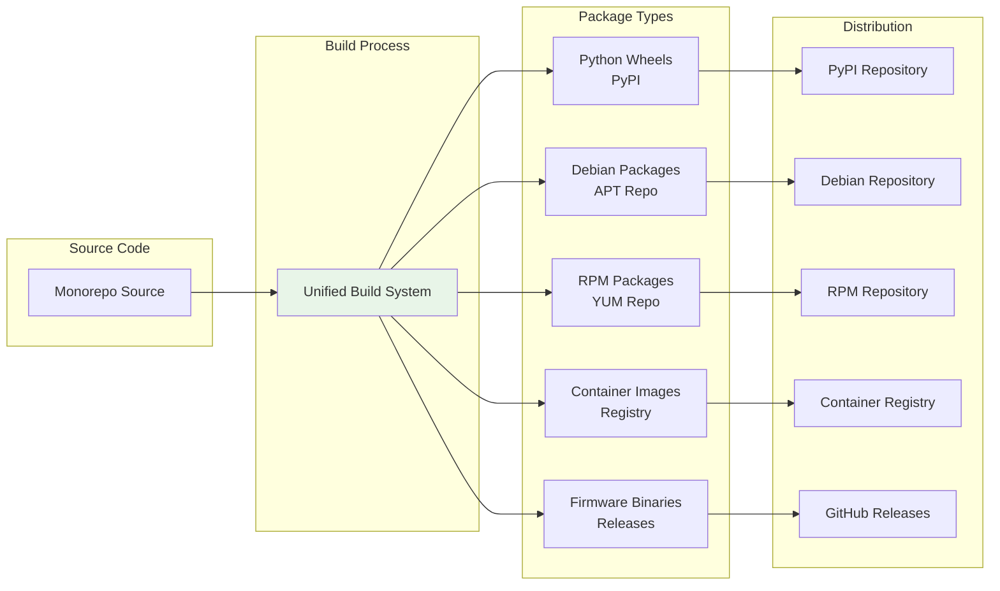

# Architecture

This document describes the overall architecture of the Jumpstarter monorepo and how components interact.

## System Overview

The Jumpstarter system consists of multiple components working together to provide a comprehensive testing and automation platform.

## Component Architecture

### Core Components

#### Jumpstarter Library (`core/jumpstarter/`)
- Main Python library and CLI
- Provides core functionality and APIs
- Plugin system for extensibility

#### Controller (`core/controller/`)
- Kubernetes controller written in Go
- Manages test environments and resources
- Handles orchestration and scheduling

#### Protocol (`core/protocol/`)
- Communication protocol definitions
- Shared data structures
- API specifications

### Hardware Components

#### DUT Link Firmware (`hardware/dutlink-firmware/`)
- Rust-based firmware for hardware control
- Low-level device interaction
- Real-time communication protocols

#### DUT Link Board (`hardware/dutlink-board/`)
- Hardware design files
- PCB layouts and schematics
- Component specifications

## Monorepo Build Architecture

The monorepo uses a unified build system that coordinates between different technologies:

## Design Principles

1. **Modularity**: Each component can be developed and tested independently
2. **Consistency**: Unified build, test, and deployment processes
3. **Scalability**: Components can scale independently
4. **Maintainability**: Clear separation of concerns
5. **Extensibility**: Plugin architecture for custom functionality

## Data Flow Architecture

## Deployment Architecture

The system supports multiple deployment models:

## Package Distribution Flow

## Security Considerations

- Component isolation
- Secure communication protocols
- Access control and authentication
- Audit logging