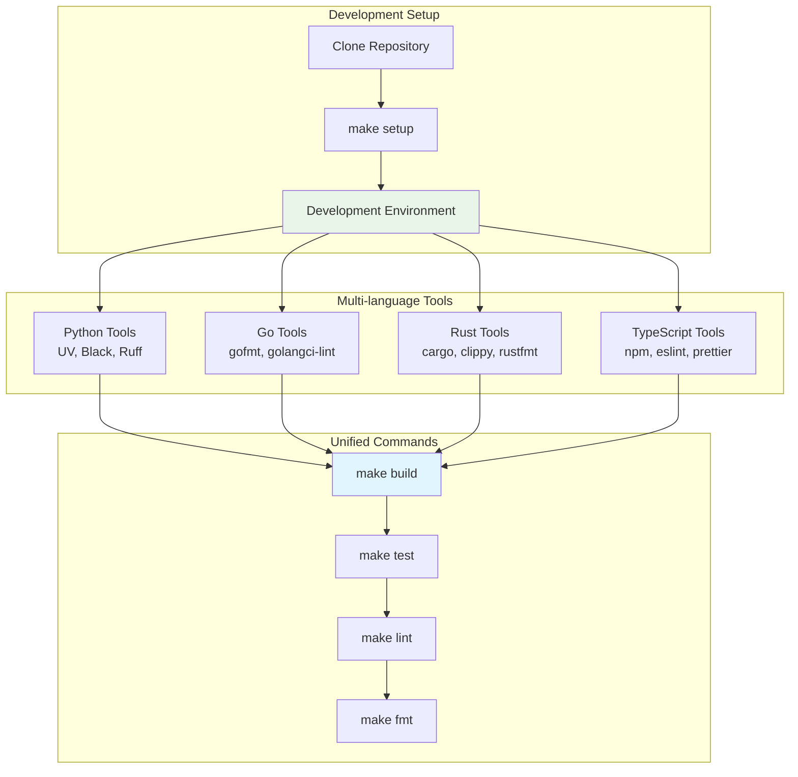
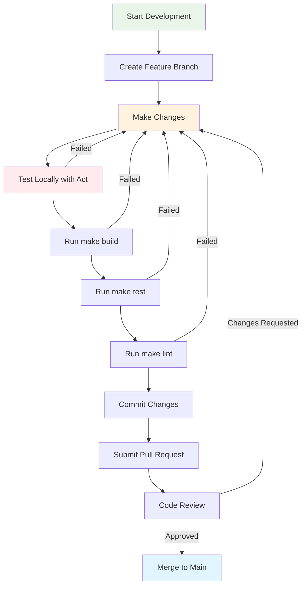
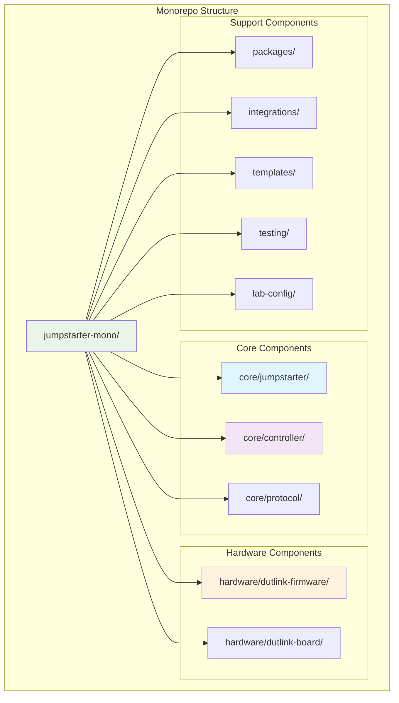
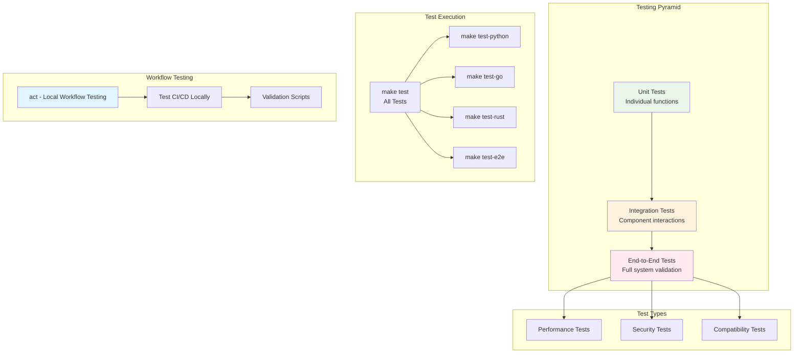

# Development Guide

This guide covers the development workflow for the Jumpstarter monorepo.

## Development Environment

The monorepo uses a unified development environment with multi-language support.



### Available Commands

Use `make help` to see all available commands:

- `make setup` - Initial setup of development environment
- `make build` - Build all components
- `make test` - Run all tests
- `make lint` - Run all linters
- `make fmt` - Format all code
- `make clean` - Clean all build artifacts

### Language-specific Development

#### Python

```bash
make dev-python    # Start Python development environment
make test-python   # Run Python tests
make lint-python   # Lint Python code
```

#### Go

```bash
make dev-go       # Start Go development environment
make test-go      # Run Go tests
make lint-go      # Lint Go code
```

#### Rust

```bash
make dev-rust     # Start Rust development environment
make test-rust    # Run Rust tests
make lint-rust    # Lint Rust code
```

## Contributing

### Workflow



1. Create a feature branch
2. Make your changes
3. **Test workflows locally**: See [Local Workflow Testing](act-integration.md) for act integration
4. Run tests: `make test`
5. Run linting: `make lint`
6. Submit a pull request

### Code Standards

- Follow language-specific conventions
- Ensure all tests pass
- Maintain documentation
- Use pre-commit hooks: `make pre-commit-install`

## Project Structure

Each component follows its own conventions while integrating with the monorepo build system.



### Core Components

- `core/jumpstarter/` - Main Python library
- `core/controller/` - Kubernetes controller (Go)
- `core/protocol/` - Protocol definitions

### Hardware Components

- `hardware/dutlink-firmware/` - Rust firmware
- `hardware/dutlink-board/` - Hardware design files

## Testing

The monorepo includes comprehensive testing:



### Local Workflow Testing

Test GitHub Actions workflows locally using [act](https://github.com/nektos/act):

```bash
# Test the full CI pipeline locally
act workflow_dispatch -W .github/workflows/ci.yml --env ACT=true

# Validate all workflows
./scripts/validate-ci-with-act.sh
```

For detailed instructions, see [Local Workflow Testing](act-integration.md).

### Code Testing

- Unit tests for each component
- Integration tests
- End-to-end tests
- Performance tests

Run all tests with:

```bash
make test
```
