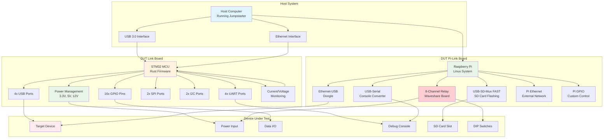
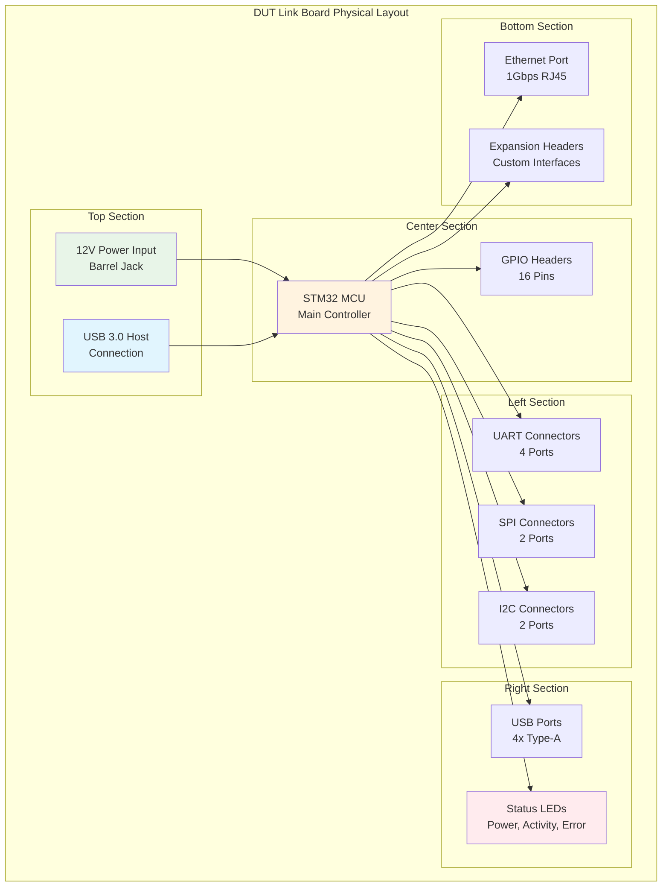
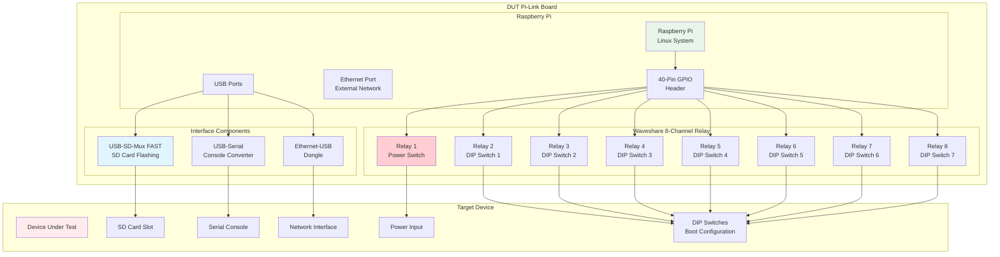
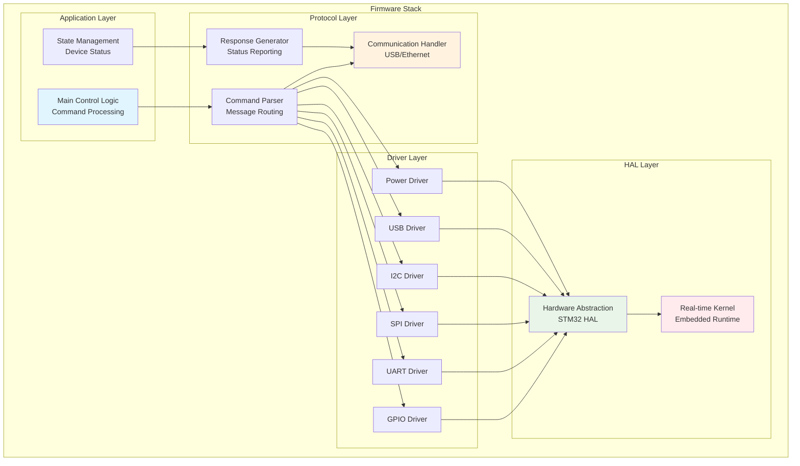

# Hardware Documentation

This section covers the hardware components of the Jumpstarter system.

## Hardware Architecture Overview



## DUT Link Board

## Original DUT Link Board

The original DUT Link Board is a custom hardware solution for interfacing with devices under test.

### Features

- Multiple I/O interfaces
- Power control and monitoring
- Real-time data acquisition
- USB and Ethernet connectivity

### Specifications

#### Power

- Input: 12V DC
- Output: Configurable 3.3V, 5V, 12V
- Current monitoring: Up to 10A
- Protection: Over-current, over-voltage

#### I/O Interfaces

- GPIO: 16 configurable pins
- UART: 4 ports
- SPI: 2 ports
- I2C: 2 ports
- USB: 4 ports (host/device configurable)

#### Connectivity

- Ethernet: 1Gbps
- USB 3.0: Host connection
- Expansion headers for custom interfaces

### Board Layout



## DUT Pi-Link Board

The DUT Pi-Link Board is a Raspberry Pi-based hardware solution that provides additional capabilities for device testing and automation, particularly focused on power management, DIP switch control, and SD card flashing.

### Architecture Overview



### Key Features

#### Power Management

- **Relay Channel 1**: Primary power switch capability
- **Clean power cycling**: Software-controlled power on/off sequences
- **Power sequencing**: Configurable delays for proper device initialization

#### DIP Switch Override

- **Relay Channels 2-8**: Override individual DIP switches
- **Boot configuration control**: Change device boot modes remotely
- **Hardware configuration**: Modify device settings without physical access
- **Test mode selection**: Switch between different operational modes

#### SD Card Management

- **USB-SD-Mux FAST**: High-speed SD card flashing and switching
- **Remote imaging**: Flash new firmware/OS images without physical access
- **Boot media control**: Switch between different boot images
- **Fast switching**: Quick transition between host and target SD access

#### Console Access

- **USB-Serial Converter**: Direct access to device debug console
- **Remote monitoring**: Capture boot logs and runtime messages
- **Interactive debugging**: Send commands to device console
- **Log collection**: Automated capture of device output

#### Network Configuration

- **Dual Ethernet Setup**:
  - **External Network**: Pi's built-in Ethernet for management
  - **DUT Internal Network**: USB-Ethernet dongle for device communication
- **Network isolation**: Separate management and test networks
- **DHCP/Static IP**: Flexible IP configuration for both networks

### Hardware Specifications

#### Raspberry Pi Base

- **Model**: Raspberry Pi 4B (4GB+ recommended)
- **Storage**: 32GB+ microSD card for Pi OS
- **Power**: 5V/3A USB-C power supply
- **Connectivity**: Built-in WiFi, Bluetooth, Ethernet

#### Waveshare 8-Channel Relay Board

- **Relay Type**: SPDT (Single Pole Double Throw)
- **Contact Rating**: 10A/250VAC, 10A/30VDC
- **Control Voltage**: 3.3V/5V compatible
- **Interface**: GPIO control via Pi header

#### USB-SD-Mux FAST Specifications

- **Switching Speed**: <1 second
- **USB Interface**: USB 3.0 SuperSpeed
- **SD Card Support**: SDHC/SDXC up to 2TB
- **Remote Control**: Software-controlled switching

### Software Integration

#### Jumpstarter Integration

```python
from jumpstarter.hardware import PiLinkBoard

# Initialize Pi-Link Board
board = PiLinkBoard(
    hostname="pi-link-001.local",
    relay_channels=8,
    sd_mux=True,
    serial_console=True
)

# Power cycle with DIP switch configuration
board.power_off()
board.set_dip_switches([1, 0, 1, 0, 1, 0, 0])  # Configure boot mode
board.flash_sd_card("firmware_v2.1.img")
board.power_on()

# Monitor console output
console_log = board.read_console(timeout=30)
print(f"Boot log: {console_log}")
```

#### Configuration Management

```yaml
# pi-link-config.yaml
board:
  hostname: "pi-link-001.local"

power:
  relay_channel: 1
  power_on_delay: 2.0
  power_off_delay: 1.0

dip_switches:
  relay_channels: [2, 3, 4, 5, 6, 7, 8]
  boot_modes:
    normal: [0, 0, 0, 0, 0, 0, 0]
    recovery: [1, 0, 0, 0, 0, 0, 0]
    factory: [0, 1, 0, 0, 0, 0, 0]
    test: [1, 1, 0, 0, 0, 0, 0]

sd_mux:
  device: "/dev/usbsdmux-001"
  mount_point: "/mnt/dut-sd"

console:
  device: "/dev/ttyUSB0"
  baudrate: 115200
  timeout: 30

network:
  management:
    interface: "eth0"
    ip: "192.168.1.100"
  dut:
    interface: "eth1" # USB-Ethernet adapter
    ip: "10.0.0.1"
    dhcp_range: "10.0.0.10-10.0.0.50"
```

### Setup and Configuration

#### Initial Setup

1. **Prepare Raspberry Pi**:

   ```bash
   # Flash Raspberry Pi OS
   sudo dd if=raspios-lite.img of=/dev/sdX bs=4M status=progress

   # Enable SSH and configure networking
   touch /boot/ssh
   echo 'pi:$encrypted_password' > /boot/userconf.txt
   ```

2. **Install Dependencies**:

   ```bash
   sudo apt update
   sudo apt install python3-pip python3-venv git
   sudo pip3 install jumpstarter-pi-link
   ```

3. **Configure Hardware**:
   ```bash
   # Enable GPIO and serial interfaces
   sudo raspi-config nonint do_spi 0
   sudo raspi-config nonint do_serial 0
   sudo raspi-config nonint do_ssh 0
   ```

#### Relay Board Connection

```bash
# GPIO Pin Mapping for Waveshare 8-Channel Relay
Relay 1 (Power): GPIO 26
Relay 2 (DIP 1): GPIO 20
Relay 3 (DIP 2): GPIO 21
Relay 4 (DIP 3): GPIO 22
Relay 5 (DIP 4): GPIO 23
Relay 6 (DIP 5): GPIO 24
Relay 7 (DIP 6): GPIO 25
Relay 8 (DIP 7): GPIO 27
```

### Use Cases

#### Automated Firmware Testing

```python
# Test multiple firmware versions
firmware_images = [
    "firmware_v1.0.img",
    "firmware_v1.1.img",
    "firmware_v2.0.img"
]

for image in firmware_images:
    board.power_off()
    board.flash_sd_card(image)
    board.set_dip_switches([0, 0, 0, 0, 0, 0, 0])  # Normal boot
    board.power_on()

    # Wait for boot and run tests
    if board.wait_for_boot(timeout=60):
        test_results = run_firmware_tests(board)
        log_results(image, test_results)
```

#### Boot Mode Testing

```python
# Test different boot configurations
boot_modes = {
    "normal": [0, 0, 0, 0, 0, 0, 0],
    "recovery": [1, 0, 0, 0, 0, 0, 0],
    "factory": [0, 1, 0, 0, 0, 0, 0]
}

for mode, dip_config in boot_modes.items():
    board.power_off()
    board.set_dip_switches(dip_config)
    board.power_on()

    boot_log = board.read_console(timeout=30)
    validate_boot_mode(mode, boot_log)
```

### Troubleshooting

#### Common Issues

1. **Relay Not Switching**
   - Check GPIO pin connections
   - Verify relay board power supply
   - Test individual GPIO pins

2. **SD-Mux Not Working**
   - Check USB connection
   - Verify device permissions
   - Update usbsdmux firmware

3. **Console Not Accessible**
   - Check USB-serial adapter connection
   - Verify device permissions (`sudo usermod -a -G dialout $USER`)
   - Test with different baud rates

4. **Network Issues**
   - Verify USB-Ethernet adapter driver
   - Check network configuration
   - Test connectivity with ping

#### Debug Commands

```bash
# Test relay control
gpio -g mode 26 out
gpio -g write 26 1  # Turn on relay 1
gpio -g write 26 0  # Turn off relay 1

# Check SD-Mux status
usbsdmux /dev/usbsdmux-001 get

# Test serial console
minicom -D /dev/ttyUSB0 -b 115200

# Check network interfaces
ip addr show
ping -c 3 10.0.0.10
```

### Safety and Best Practices

#### Electrical Safety

- Use appropriate relay ratings for your DUT power requirements
- Implement proper isolation between relay contacts and control circuits
- Add fuses/circuit breakers for overcurrent protection

#### Software Safety

- Implement timeout mechanisms for all operations
- Add retry logic for hardware communication
- Log all control operations for debugging

#### Maintenance

- Regular testing of relay switching cycles
- Periodic cleaning of relay contacts
- SD card wear monitoring and replacement
- Network connectivity verification

## Original DUT Link Board

## DUT Link Firmware

The firmware is written in Rust and provides low-level hardware control.

### Firmware Architecture



### Features

- Real-time operation
- Low latency communication
- Robust error handling
- Firmware update capability

### Communication Protocol

The firmware uses a custom protocol over USB/Ethernet:

```rust
#[derive(Debug, Serialize, Deserialize)]
pub enum Command {
    PowerOn { port: u8 },
    PowerOff { port: u8 },
    ReadGpio { pin: u8 },
    WriteGpio { pin: u8, value: bool },
    // ... more commands
}
```

## Setup and Configuration

### Initial Setup

1. Connect the DUT Link Board to your host system
2. Flash the firmware using the programming interface
3. Configure network settings if using Ethernet

### Firmware Updates

Update firmware using the built-in bootloader:

```bash
jumpstarter firmware update dutlink-board.bin
```

### Calibration

Calibrate voltage and current measurements:

```bash
jumpstarter calibrate --board dutlink-001
```

## Troubleshooting

### Common Issues

1. **Board Not Detected**
   - Check USB/Ethernet connections
   - Verify drivers are installed
   - Check power supply

2. **Communication Errors**
   - Verify firmware version compatibility
   - Check cable integrity
   - Review network configuration

3. **Power Issues**
   - Check input voltage (12V ±5%)
   - Verify current limits
   - Check for short circuits

### Debug Tools

- **Status LEDs**: Indicate board state
- **Debug UART**: Low-level debugging
- **Web Interface**: Configuration and monitoring

## Extension and Customization

### Custom Drivers

Add support for new devices:

```rust
impl DeviceDriver for CustomDevice {
    fn initialize(&mut self) -> Result<(), Error> {
        // Implementation
        Ok(())
    }

    fn reset(&mut self) -> Result<(), Error> {
        // Implementation
        Ok(())
    }
}
```

### Expansion Boards

Create expansion boards for specialized testing:

- Analog test interfaces
- High-speed digital interfaces
- RF test capabilities
- Environmental sensors

## Safety Considerations

- Always verify connections before powering on
- Use appropriate current limits
- Follow ESD protection procedures
- Ensure proper grounding
