# Hardware Documentation

This section covers the hardware components of the Jumpstarter system.

## Hardware Architecture Overview


## DUT Link Board

The DUT Link Board is a custom hardware solution for interfacing with devices under test.

### Features

- Multiple I/O interfaces
- Power control and monitoring
- Real-time data acquisition
- USB and Ethernet connectivity

### Specifications

#### Power
- Input: 12V DC
- Output: Configurable 3.3V, 5V, 12V
- Current monitoring: Up to 10A
- Protection: Over-current, over-voltage

#### I/O Interfaces
- GPIO: 16 configurable pins
- UART: 4 ports
- SPI: 2 ports
- I2C: 2 ports
- USB: 4 ports (host/device configurable)

#### Connectivity
- Ethernet: 1Gbps
- USB 3.0: Host connection
- Expansion headers for custom interfaces

### Board Layout

```mermaid
graph TB
    subgraph "DUT Link Board Physical Layout"
        subgraph "Top Section"
            PWR_IN[12V Power Input<br/>Barrel Jack]
            USB_HOST[USB 3.0 Host<br/>Connection]
        end
        
        subgraph "Center Section"
            MCU_AREA[STM32 MCU<br/>Main Controller]
            GPIO_HDR[GPIO Headers<br/>16 Pins]
        end
        
        subgraph "Left Section"
            UART_CON[UART Connectors<br/>4 Ports]
            SPI_CON[SPI Connectors<br/>2 Ports]
            I2C_CON[I2C Connectors<br/>2 Ports]
        end
        
        subgraph "Right Section"
            USB_PORTS[USB Ports<br/>4x Type-A]
            STATUS_LED[Status LEDs<br/>Power, Activity, Error]
        end
        
        subgraph "Bottom Section"
            ETH_PORT[Ethernet Port<br/>1Gbps RJ45]
            EXPANSION[Expansion Headers<br/>Custom Interfaces]
        end
        
        PWR_IN --> MCU_AREA
        USB_HOST --> MCU_AREA
        MCU_AREA --> GPIO_HDR
        MCU_AREA --> UART_CON
        MCU_AREA --> SPI_CON
        MCU_AREA --> I2C_CON
        MCU_AREA --> USB_PORTS
        MCU_AREA --> STATUS_LED
        MCU_AREA --> ETH_PORT
        MCU_AREA --> EXPANSION
    end
    
    style MCU_AREA fill:#fff3e0
    style PWR_IN fill:#e8f5e8
    style USB_HOST fill:#e1f5fe
    style STATUS_LED fill:#ffebee
```



## DUT Link Firmware

The firmware is written in Rust and provides low-level hardware control.

### Firmware Architecture


### Features

- Real-time operation
- Low latency communication
- Robust error handling
- Firmware update capability

### Communication Protocol

The firmware uses a custom protocol over USB/Ethernet:

```rust
#[derive(Debug, Serialize, Deserialize)]
pub enum Command {
    PowerOn { port: u8 },
    PowerOff { port: u8 },
    ReadGpio { pin: u8 },
    WriteGpio { pin: u8, value: bool },
    // ... more commands
}
```

## Setup and Configuration

### Initial Setup

1. Connect the DUT Link Board to your host system
2. Flash the firmware using the programming interface
3. Configure network settings if using Ethernet

### Firmware Updates

Update firmware using the built-in bootloader:

```bash
jumpstarter firmware update dutlink-board.bin
```

### Calibration

Calibrate voltage and current measurements:

```bash
jumpstarter calibrate --board dutlink-001
```

## Troubleshooting

### Common Issues

1. **Board Not Detected**
   - Check USB/Ethernet connections
   - Verify drivers are installed
   - Check power supply

2. **Communication Errors**
   - Verify firmware version compatibility
   - Check cable integrity
   - Review network configuration

3. **Power Issues**
   - Check input voltage (12V ±5%)
   - Verify current limits
   - Check for short circuits

### Debug Tools

- **Status LEDs**: Indicate board state
- **Debug UART**: Low-level debugging
- **Web Interface**: Configuration and monitoring

## Extension and Customization

### Custom Drivers

Add support for new devices:

```rust
impl DeviceDriver for CustomDevice {
    fn initialize(&mut self) -> Result<(), Error> {
        // Implementation
        Ok(())
    }
    
    fn reset(&mut self) -> Result<(), Error> {
        // Implementation
        Ok(())
    }
}
```

### Expansion Boards

Create expansion boards for specialized testing:

- Analog test interfaces
- High-speed digital interfaces
- RF test capabilities
- Environmental sensors

## Safety Considerations

- Always verify connections before powering on
- Use appropriate current limits
- Follow ESD protection procedures
- Ensure proper grounding