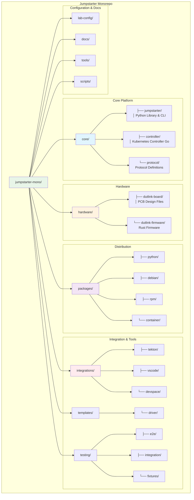

# Jumpstarter Monorepo Documentation

Welcome to the Jumpstarter monorepo documentation. This unified repository contains all Jumpstarter components in a single, manageable structure.

## Overview

The Jumpstarter monorepo brings together:

- **Core Components**: Main library, controller, and protocol definitions
- **Hardware**: DUT link board designs and firmware
- **Packages**: Distribution packages for various platforms
- **Integrations**: CI/CD tooling and development environment integrations
- **Templates**: Scaffolding for driver development
- **Testing**: Comprehensive testing infrastructure

## Quick Navigation

- [Installation Guide](installation/index.md) - Get started with Jumpstarter
- [Development Guide](development/index.md) - Contribute to the project
- [Architecture](architecture/index.md) - Understand the system design
- [User Guide](user-guide/index.md) - Learn how to use Jumpstarter
- [Hardware](hardware/index.md) - Hardware components and specifications
- [Integrations](integrations/index.md) - CI/CD and tooling integrations

## Repository Structure

The monorepo is organized into logical components:



## Getting Started

To get started with development:

```bash
# Clone the repository
git clone https://github.com/the78mole/jumpstarter-mono.git
cd jumpstarter-mono

# Setup development environment
make setup

# View available commands
make help
```

For detailed instructions, see the [Installation Guide](installation/index.md).
