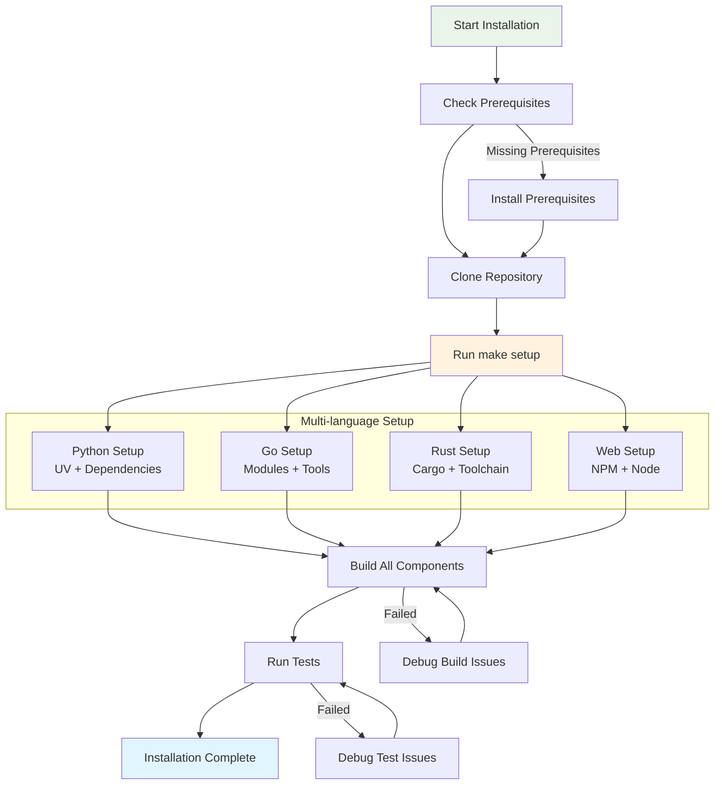
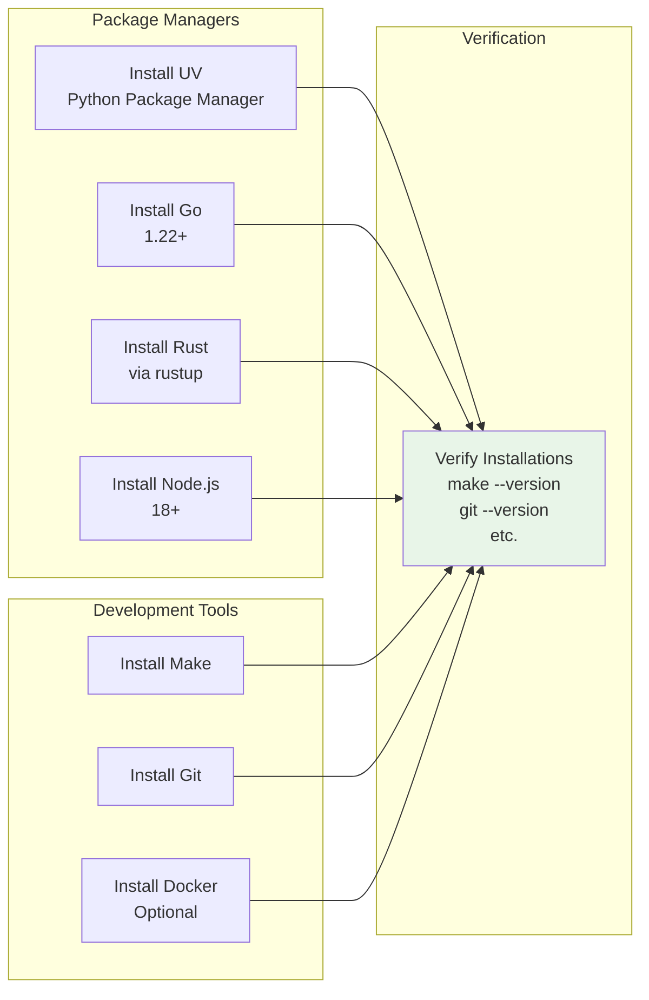

# Installation Guide

This guide will help you install and set up the Jumpstarter monorepo for development or production use.

## Installation Overview



## Prerequisites

### System Requirements

- Python 3.12 or later
- Go 1.22 or later
- Rust (latest stable)
- Node.js 18 or later
- Git

### Tools

- [uv](https://github.com/astral-sh/uv) - Python package manager
- Make - Build orchestration
- Docker (optional) - For containerized development

### Prerequisites Installation Flow



## Quick Setup

1. Clone the repository:

   ```bash
   git clone https://github.com/the78mole/jumpstarter-mono.git
   cd jumpstarter-mono
   ```

2. Run the setup command:
   ```bash
   make setup
   ```

This will install all dependencies for all components in the monorepo.

## Component-specific Setup

### Component Build Dependencies

```mermaid
graph TB
    subgraph "Python Ecosystem"
        PY_PROJ[pyproject.toml<br/>Workspace Config]
        UV_LOCK[uv.lock<br/>Dependency Lock]
        PY_COMP[Python Components<br/>core/jumpstarter<br/>templates/driver]
    end

    subgraph "Go Ecosystem"
        GO_WORK[go.work<br/>Workspace Config]
        GO_MOD[go.mod files<br/>Module Definitions]
        GO_COMP[Go Components<br/>core/controller<br/>lab-config]
    end

    subgraph "Rust Ecosystem"
        CARGO_TOML[Cargo.toml<br/>Package Config]
        CARGO_LOCK[Cargo.lock<br/>Dependency Lock]
        RUST_COMP[Rust Components<br/>hardware/dutlink-firmware]
    end

    subgraph "Web Ecosystem"
        PACKAGE_JSON[package.json<br/>Package Config]
        PACKAGE_LOCK[package-lock.json<br/>Dependency Lock]
        WEB_COMP[Web Components<br/>integrations/vscode]
    end

    PY_PROJ --> UV_LOCK
    UV_LOCK --> PY_COMP

    GO_WORK --> GO_MOD
    GO_MOD --> GO_COMP

    CARGO_TOML --> CARGO_LOCK
    CARGO_LOCK --> RUST_COMP

    PACKAGE_JSON --> PACKAGE_LOCK
    PACKAGE_LOCK --> WEB_COMP

    style PY_PROJ fill:#e1f5fe
    style GO_WORK fill:#f3e5f5
    style CARGO_TOML fill:#fff3e0
    style PACKAGE_JSON fill:#e8f5e8
```



### Python Components

Python components use `uv` for dependency management:

```bash
make build-python
```

### Go Components

Go components are managed with Go modules:

```bash
make build-go
```

### Rust Components

Rust components use Cargo:

```bash
make build-rust
```

### Web Components

TypeScript/Node.js components use npm:

```bash
make build-web
```

## Verification

To verify your installation:

```bash
make test
```

## Next Steps

- [Development Guide](../development/index.md) - Learn about the development workflow
- [Architecture](../architecture/index.md) - Understand the system design
