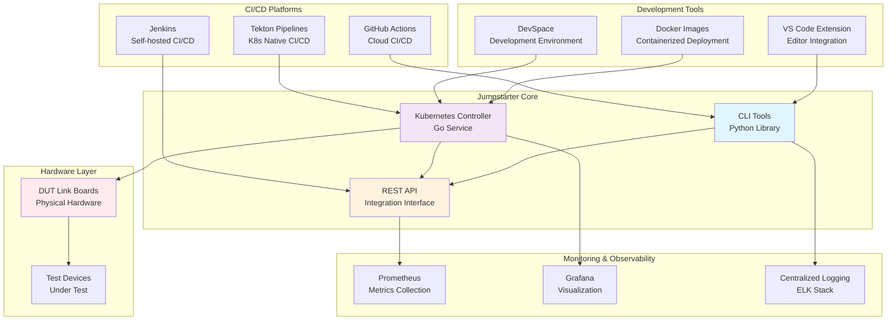
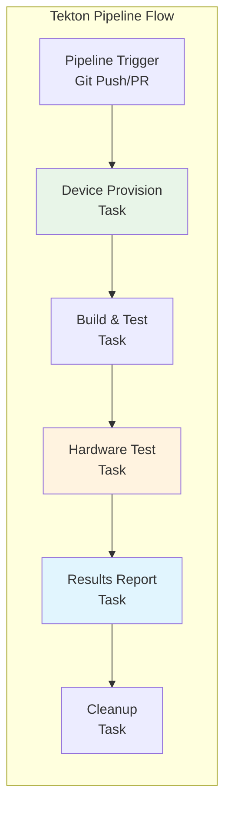
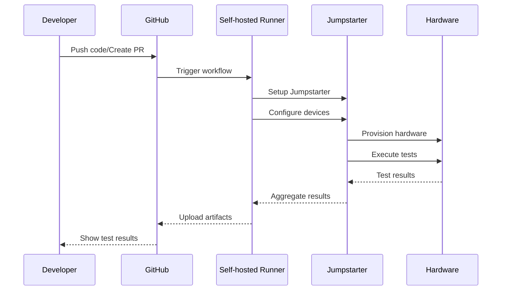
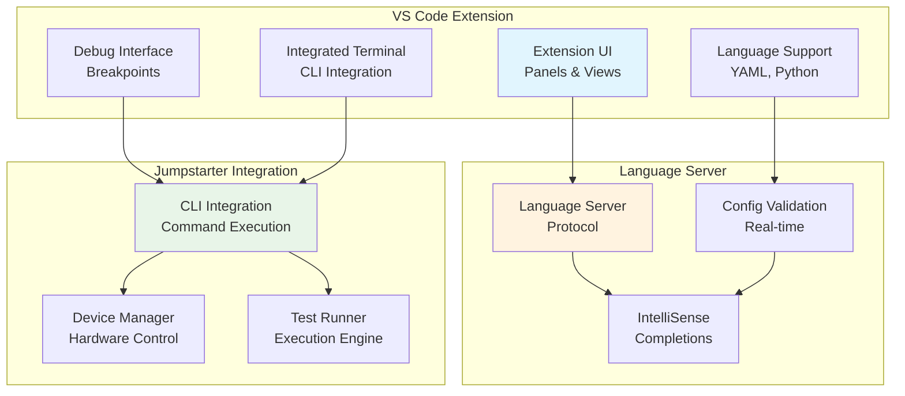
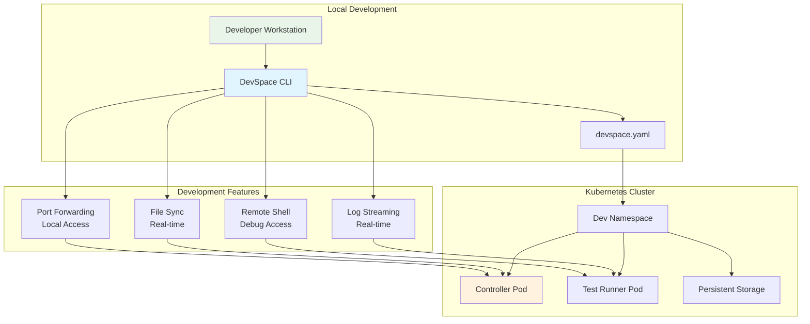

# Integrations

This section covers integrations with CI/CD systems and development tools.

## Integration Architecture Overview



## CI/CD Integrations

### Tekton Pipelines

Tekton tasks and pipelines for cloud-native CI/CD.



#### Available Tasks

- **jumpstarter-test**: Run hardware tests in Tekton pipelines
- **device-provision**: Provision test devices
- **results-collect**: Collect and process test results

#### Example Pipeline

```yaml
apiVersion: tekton.dev/v1beta1
kind: Pipeline
metadata:
  name: hardware-test-pipeline
spec:
  params:
    - name: device-config
      type: string
  tasks:
    - name: provision-device
      taskRef:
        name: device-provision
      params:
        - name: config
          value: $(params.device-config)
    - name: run-tests
      runAfter: [provision-device]
      taskRef:
        name: jumpstarter-test
      params:
        - name: test-suite
          value: integration
```

### GitHub Actions Integration Flow



#### Available Actions

- `jumpstarter-dev/setup-action`: Setup Jumpstarter environment
- `jumpstarter-dev/test-action`: Run hardware tests
- `jumpstarter-dev/report-action`: Generate test reports

#### Example Workflow

```yaml
name: Hardware CI
on: [push, pull_request]

jobs:
  hardware-tests:
    runs-on: self-hosted
    steps:
      - uses: actions/checkout@v4
      - uses: jumpstarter-dev/setup-action@v1
        with:
          version: latest
      - uses: jumpstarter-dev/test-action@v1
        with:
          config: tests/ci-config.yaml
          devices: raspberry-pi,arduino
      - uses: jumpstarter-dev/report-action@v1
        if: always()
        with:
          format: junit
```

## Development Environment Integrations

### VS Code Extension Architecture



The Jumpstarter VS Code extension provides:

- Syntax highlighting for configuration files
- IntelliSense for test definitions
- Integrated test runner
- Device management interface
- Real-time test monitoring

#### Installation

```bash
code --install-extension jumpstarter.jumpstarter-vscode
```

#### Features

1. **Configuration Validation**: Real-time validation of YAML configs
2. **Test Runner**: Run tests directly from the editor
3. **Device Explorer**: Browse and manage connected devices
4. **Log Viewer**: View test logs with syntax highlighting
5. **Debugging**: Set breakpoints in test scripts

### DevSpace Development Environment



DevSpace configuration for development environments.

#### Setup

```yaml
# devspace.yaml
version: v2beta1
name: jumpstarter-dev

pipelines:
  dev:
    run: |
      start_dev hardware-controller
      start_dev test-runner

deployments:
  hardware-controller:
    helm:
      chart:
        name: jumpstarter-controller
  test-runner:
    kubectl:
      manifests:
        - k8s/test-runner.yaml

dev:
  hardware-controller:
    imageSelector: jumpstarter/controller
    workingDir: /app
    ports:
      - port: "8080:8080"
```

## Container Integrations

### Docker Images

Pre-built Docker images for easy deployment:

- `jumpstarter/controller`: Kubernetes controller
- `jumpstarter/cli`: Command-line interface
- `jumpstarter/test-runner`: Test execution environment

#### Example Usage

```bash
# Run CLI in container
docker run --rm -v $(pwd):/workspace jumpstarter/cli run tests/

# Start controller
docker run -d --name controller jumpstarter/controller

# Run test runner
docker run --rm --device /dev/ttyUSB0 jumpstarter/test-runner
```

### Kubernetes Deployment

Deploy Jumpstarter in Kubernetes:

```yaml
apiVersion: apps/v1
kind: Deployment
metadata:
  name: jumpstarter-controller
spec:
  replicas: 1
  selector:
    matchLabels:
      app: jumpstarter-controller
  template:
    metadata:
      labels:
        app: jumpstarter-controller
    spec:
      containers:
        - name: controller
          image: jumpstarter/controller:latest
          ports:
            - containerPort: 8080
          env:
            - name: CONFIG_PATH
              value: /etc/jumpstarter/config.yaml
```

## Monitoring and Observability

### Prometheus Metrics

Jumpstarter exports metrics for monitoring:

- Test execution duration
- Device availability
- Error rates
- Queue depth

### Grafana Dashboards

Pre-built dashboards for visualization:

- Test execution overview
- Device health monitoring
- Performance metrics
- Error analysis

### Logging Integration

Integration with logging systems:

- Structured JSON logging
- Correlation IDs for tracing
- Configurable log levels
- Log forwarding to external systems

## Custom Integrations

### Plugin Architecture

Create custom integrations using the plugin system:

```python
from jumpstarter.plugin import BasePlugin

class CustomIntegration(BasePlugin):
    def __init__(self, config):
        self.config = config

    def on_test_start(self, test_info):
        # Custom logic for test start
        pass

    def on_test_complete(self, test_results):
        # Custom logic for test completion
        pass
```

### API Integration

REST API for external integrations:

```bash
# Start a test
curl -X POST http://localhost:8080/api/v1/tests \
  -H "Content-Type: application/json" \
  -d '{"config": "test-config.yaml"}'

# Get test status
curl http://localhost:8080/api/v1/tests/12345/status

# Get test results
curl http://localhost:8080/api/v1/tests/12345/results
```
